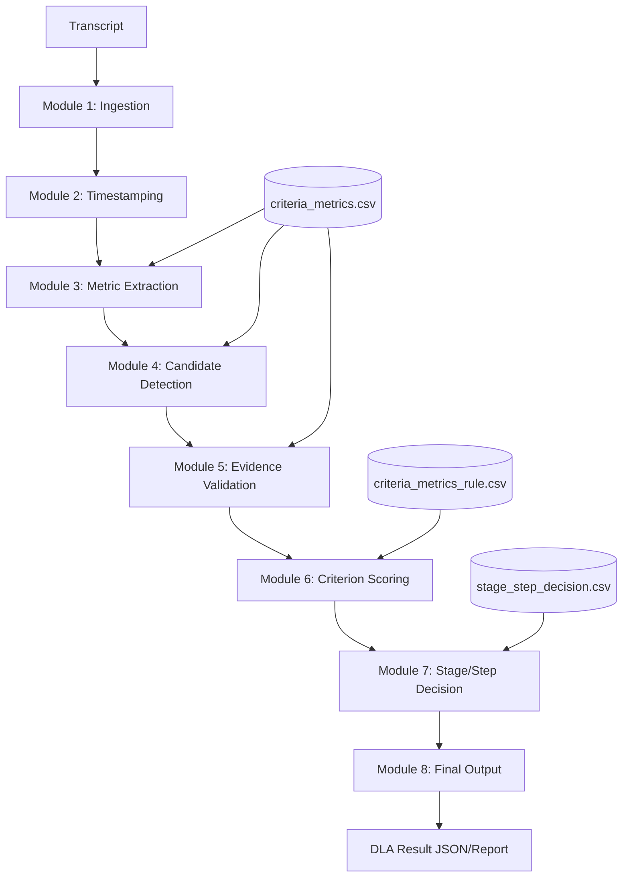

# DLA Evaluation Engine Architecture

## 1. System Architecture
The system is designed as a **Modular Pipeline** where each stage is dependent on the output of the previous one, and all logic is governed by external **Rule Tables (CSVs)**.

### Core Components:
- **Pipeline Controller**: Orchestrates the flow between modules.
- **Rule Engine**: Parses and applies logic from CSV files.
- **AI Validator**: Uses LLM (Gemini) for semantic evidence verification.
- **Metric Processor**: Deterministic engine for linguistic metrics.

---

## 2. Module Responsibilities & CSV Usage

### Module 1: Transcript Ingestion
- **Responsibility**: Normalizes input (JSON/Text) into a standard `TranscriptSegment[]` format.
- **CSV Usage**: None.

### Module 2: Word Timestamp Processing
- **Responsibility**: Aligns text with audio timestamps for precise evidence traceability.
- **CSV Usage**: None.

### Module 3: Metric Extraction
- **Responsibility**: Calculates deterministic linguistic values (MLU, TTR, etc.).
- **CSV Usage**: Uses `criteria_metrics.csv` to identify which metrics are required for the evaluation framework.

### Module 4: Candidate Criterion Detection
- **Responsibility**: Filters the full set of DLA criteria down to those "triggered" by the extracted metrics.
- **CSV Usage**: Uses `criteria_metrics.csv` to map metric signals to specific criteria.

### Module 5: Evidence Validation
- **Responsibility**: Inspects transcript segments to find semantic proof for candidate criteria.
- **CSV Usage**: Uses `criteria_metrics.csv` for the **definitions** used in AI prompts to ensure alignment with the DLA framework.

### Module 6: Criterion Scoring
- **Responsibility**: Aggregates evidence into binary or scalar scores for each criterion.
- **CSV Usage**: Uses `criteria_metrics_rule.csv` to define thresholds for **evidence_quality**, **independence**, and **reproducibility**.

### Module 7: Stage/Step Decision
- **Responsibility**: Applies the final rule-based logic to determine the speaker's DLA level.
- **CSV Usage**: Uses `stage_step_decision.csv` as the source of truth for Stage (A-F) and Step (1-8) requirements.

### Module 8: Final Output Generation
- **Responsibility**: Packages metrics, evidence, and decisions into a structured, auditable report.
- **CSV Usage**: None.

---

## 3. Data Flow Diagram

